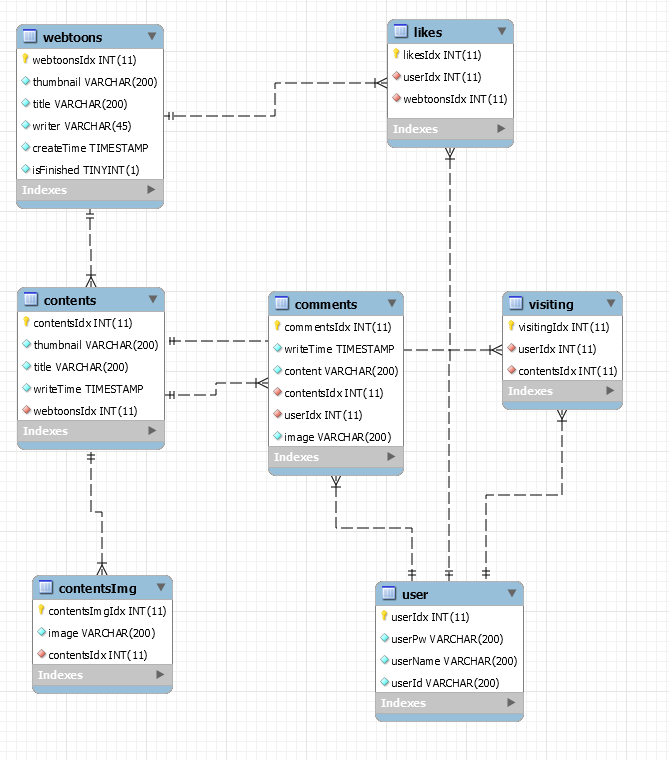

# Project : 솝커툰
2019년 SOPT 24기 합동 세미나 과제

## 목표
'솝커툰'이라는 소규모 프로젝트에 대해, 클라이언트가 이용할 API를 제작

## 사용한 도구
- Github
- DB (MySQL, WorkBench, AWS RDS, Redis)
- Node.js (+ Express.js)
- AWS (EC2, RDS, S3, IAM)

## 사용한 개념 (공부한 개념)
### Node.js 
- Node.js의 Async/Await를 적극 활용
- 유지 및 보수가 쉽도록 라우팅 폴더 및 파일 구성
- 상태 코드, 상태 메시지를 모듈을 통해 일관되게 발송
- json의 형태로 클라이언트한테 데이터를 전송
- 배포 환경을 위한 준비 (cross-env, morgan, Redis, pm2)

### 사용한 Node.js 모듈
- connect-redis : Redis를 통해 세션 정보 저장을 위한 데이터베이스 구축
- cross-env : 환경변수(process.env)를 동적 변수로 활용
- crypto-promise : 비밀번호 암호화
- dotenv : 비밀키를 안전하게 저장, 관리, 사용
- jsonwebtoken : JWT 토큰으로 인증
- multer, multer-s3 : 파일(+이미지) 업로드
- express-session, passport, passport-local : 로그인 로직 구현
- promise-mysql : mysql을 Node.js 내에서 사용
- pm2 : 서버 유지, 멀티 프로세싱
- morgan : 요청(request)에 대한 정보 출력

### AWS
- AWS의 EC2를 사용한 가상 서버 구축
- AWS RDS를 통한 DB 구축
- AWS S3를 통한 파일 저장 공간 구축
- AWS IAM를 통한 접근 제어와 권한 관리

### API
- Restful한 API문서의 특징을 일부 적용
- Swagger를 통해 API 문서 작성

### Github
- Readme를 활용한 프로젝트 정보 나타내기
- Github을 활용한 프로젝트 관리

## DB ERD

## Swagger로 작성한 API 문서

